# Purple Team Enterprise Lab

## Overview

This project documents a controlled Purple Team lab built in Hyper-V where an attacker machine in a dedicated ATTACK network targeted a Windows Server placed in a DMZ.

The lab was designed to connect offensive testing with defensive monitoring by using OPNsense, Kali Linux, Windows Server, Wazuh, Sysmon, Nmap and Nessus.

The workflow followed a full Purple Team process:

```text
Network Design -> Baseline Assessment -> Attack Simulation -> Detection Review -> Hardening -> Validation
```

The goal was not only to perform attacks, but also to verify whether the activity was visible in Wazuh and whether the environment could be improved afterwards.

All testing was performed inside an isolated and controlled local lab environment.

---

## Lab Objective

The objective of this lab was to understand how an exposed Windows Server in a DMZ can be assessed, attacked, monitored and hardened.

The lab focused on:

```text
Segmentation -> Exposed Services -> Baseline Scanning -> Remote Access Testing -> Detection Review -> Hardening Validation
```

The project demonstrates how a Purple Team workflow can connect:

* Network segmentation
* Vulnerability scanning
* Remote access testing
* Authentication monitoring
* SIEM detection
* Endpoint logging
* Security hardening
* Post-hardening validation

---

## Lab Environment

| System / Tool             | Purpose                            |
| ------------------------- | ---------------------------------- |
| Hyper-V                   | Virtual lab platform               |
| OPNsense                  | Firewall, routing and segmentation |
| Kali Linux                | Attack machine                     |
| Windows Server Target DMZ | Target server in the DMZ           |
| Wazuh Server              | SIEM and security monitoring       |
| Wazuh Agent               | Endpoint log forwarding            |
| Sysmon                    | Endpoint telemetry                 |
| Nessus Essentials         | Vulnerability scanning             |
| Nmap                      | Port and service discovery         |
| Evil-WinRM                | WinRM remote access testing        |
| smbclient                 | SMB enumeration                    |

---

## Network Segments

| Segment        | Network           | Purpose                             |
| -------------- | ----------------- | ----------------------------------- |
| Management LAN | `192.168.10.0/24` | Wazuh, Nessus and management access |
| ATTACK Zone    | `10.60.60.0/24`   | Kali Linux attack machine           |
| DMZ Zone       | `10.70.70.0/24`   | Windows Server target               |

Key IP addresses:

| System                    | IP Address      |
| ------------------------- | --------------- |
| Kali Linux                | `10.60.60.50`   |
| OPNsense ATTACK gateway   | `10.60.60.1`    |
| Windows Server Target DMZ | `10.70.70.40`   |
| OPNsense DMZ gateway      | `10.70.70.1`    |
| Wazuh Server              | `192.168.10.30` |

---

## Attack Surface

The Windows Server target was intentionally configured with several exposed services for lab purposes.

|       Port | Service | Purpose                      |
| ---------: | ------- | ---------------------------- |
|   `80/tcp` | IIS     | Web service exposure         |
|  `135/tcp` | MSRPC   | Windows RPC service          |
|  `445/tcp` | SMB     | File sharing and enumeration |
| `3389/tcp` | RDP     | Remote desktop exposure      |
| `5985/tcp` | WinRM   | Remote PowerShell access     |

A weak local administrator account was created during the attack phase to simulate poor credential management and remote access risk.

---

## Summary of Results

| Phase               | Result                                                                   |
| ------------------- | ------------------------------------------------------------------------ |
| Network Design      | ATTACK and DMZ zones were created and routed through OPNsense            |
| Baseline Assessment | Nmap and Nessus identified the exposed attack surface                    |
| Attack Simulation   | WinRM access and SMB enumeration were performed from Kali                |
| Detection Review    | Wazuh detected successful logons, failed logons and account lockout      |
| Hardening           | The weak local admin account was removed and WinRM access was restricted |
| Validation          | Evil-WinRM failed and WinRM port `5985/tcp` was filtered after hardening |

---

## Screenshots

### 1. OPNsense Interface Overview

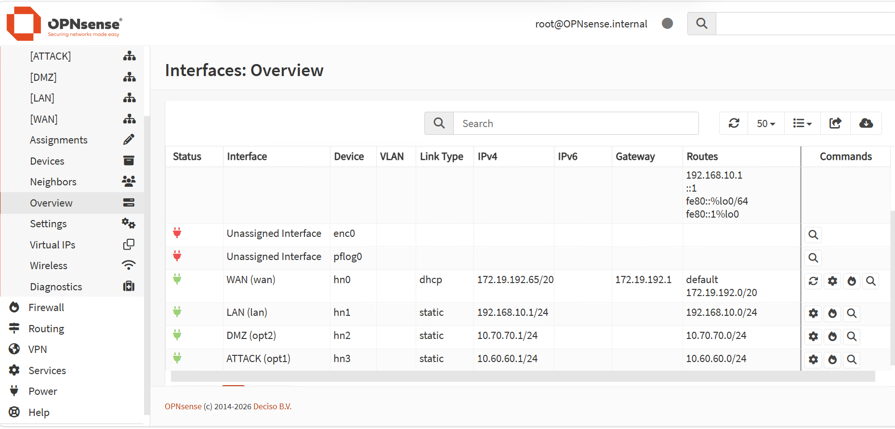

OPNsense interface overview showing the segmented lab network. The DMZ interface uses `10.70.70.1/24` and the ATTACK interface uses `10.60.60.1/24`.

---

### 2. Kali Attack IP Configuration

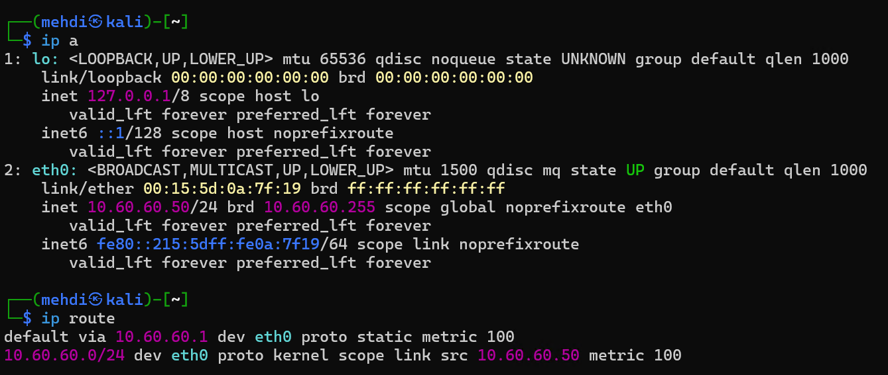

Kali Linux was placed in the ATTACK zone with IP address `10.60.60.50/24` and default gateway `10.60.60.1`.

---

### 3. Windows Server Target DMZ IP Configuration

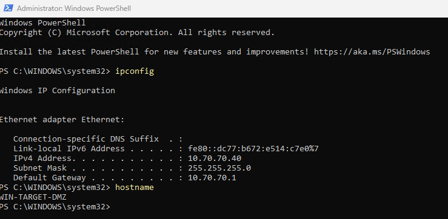

Windows Server Target DMZ was configured with IP address `10.70.70.40/24`, gateway `10.70.70.1` and hostname `WIN-TARGET-DMZ`.

---

### 4. Wazuh Agent Active

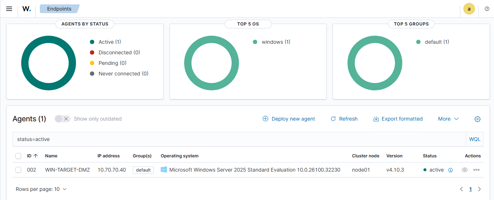

Wazuh dashboard showing the `WIN-TARGET-DMZ` agent as active. This confirmed that endpoint logs were being collected before the attack simulation.

---

### 5. Nmap Baseline Open Ports

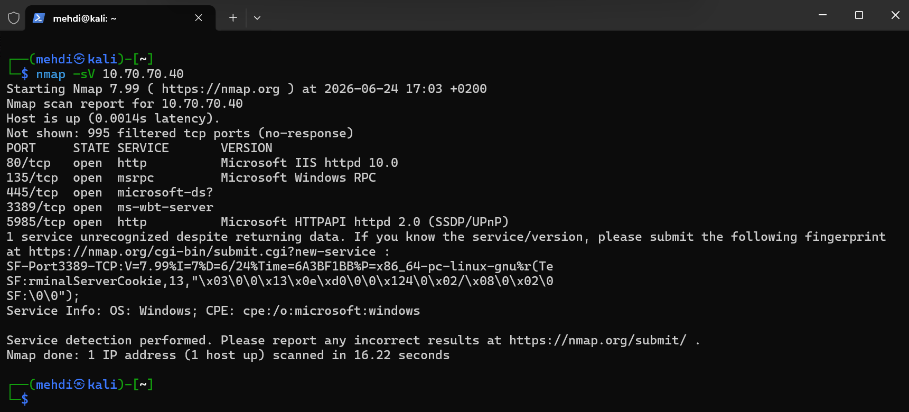

Nmap service scan from Kali against `10.70.70.40`, showing exposed services including IIS, RPC, SMB, RDP and WinRM.

---

### 6. Nessus Baseline Summary

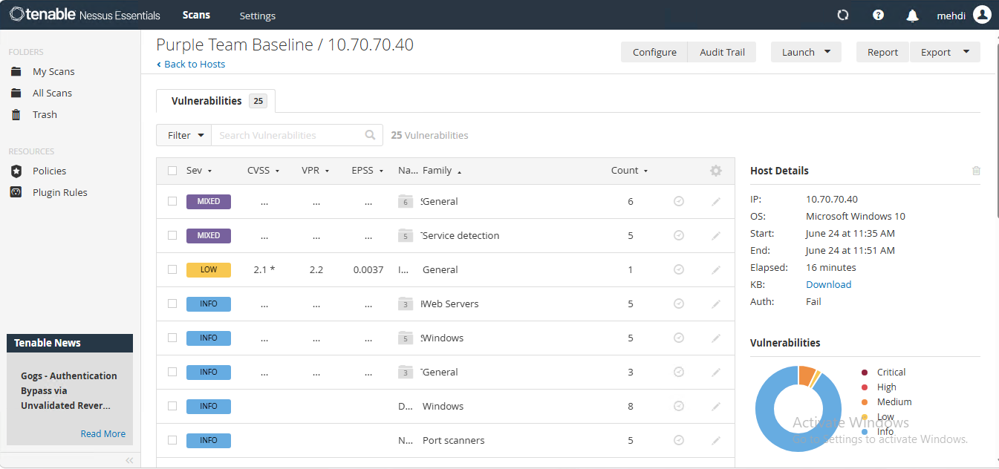

Nessus non-credentialed baseline scan against `10.70.70.40`. The scan showed no Critical or High findings, but identified Medium, Low and informational findings related to exposed services and TLS/SSL configuration.

---

### 7. Evil-WinRM Successful Login

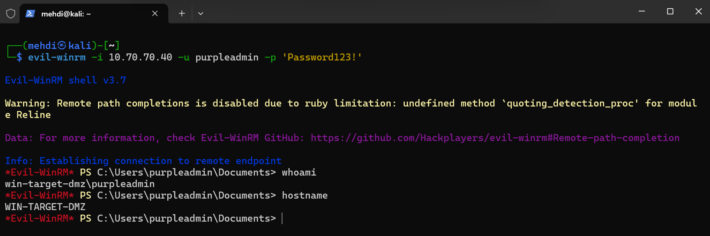

Evil-WinRM access from Kali to the DMZ target using the intentionally weak local administrator account. The commands `whoami` and `hostname` confirmed remote access as `win-target-dmz\purpleadmin`.

---

### 8. Wazuh Successful Remote Logon

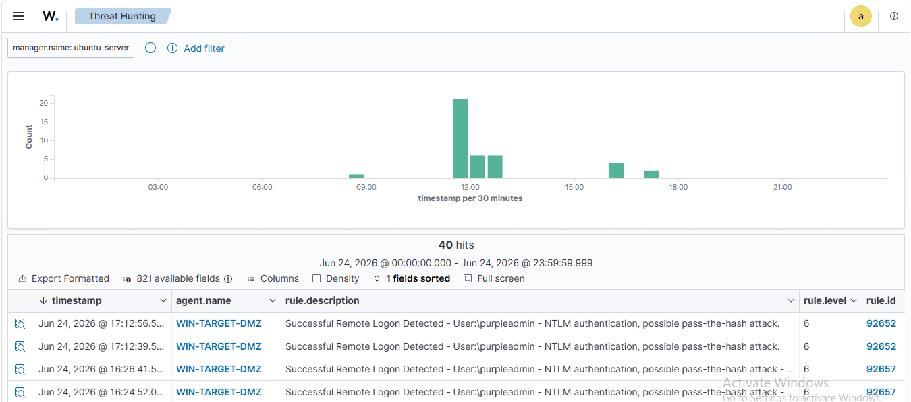

Wazuh detected the successful remote logon from the attack machine. The event was associated with the `WIN-TARGET-DMZ` agent and the `purpleadmin` account.

---

### 9. Wazuh Failed Logon

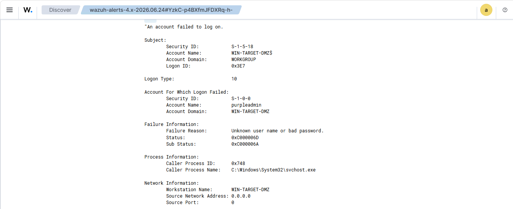

Wazuh event details showing a failed logon attempt for `purpleadmin`. This confirmed that failed authentication attempts were visible in the SIEM.

---

### 10. SMB Authenticated Share Enumeration

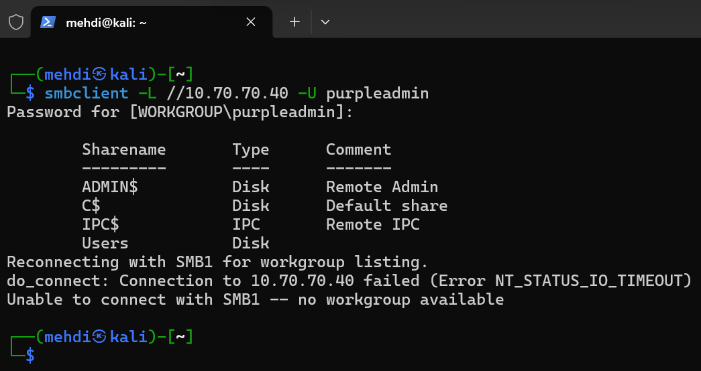

SMB enumeration from Kali using valid credentials. The target exposed administrative and user shares including `ADMIN$`, `C$`, `IPC$` and `Users`.

---

### 11. SMB User Profile Enumeration

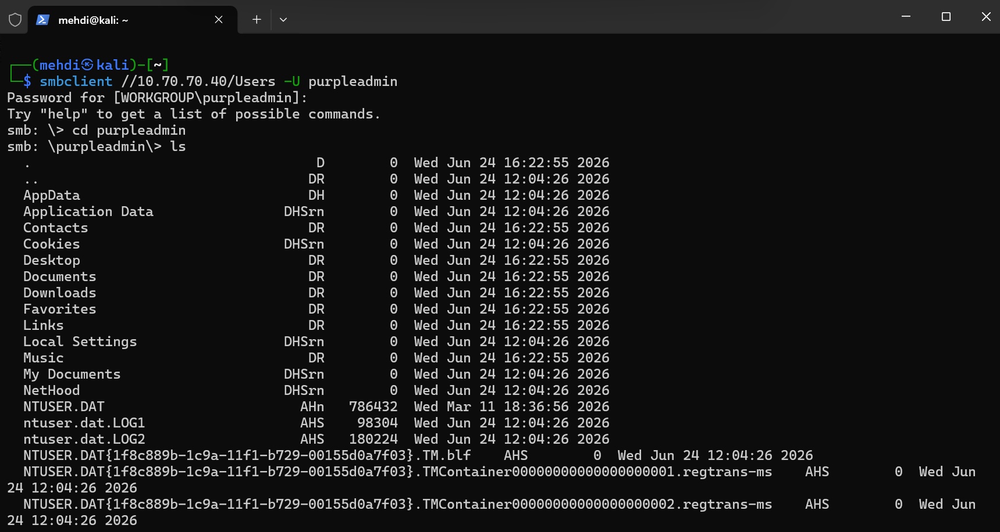

Authenticated SMB access to the `Users` share. The attacker was able to enumerate the `purpleadmin` user profile folders.

---

### 12. Wazuh Brute Force Detection

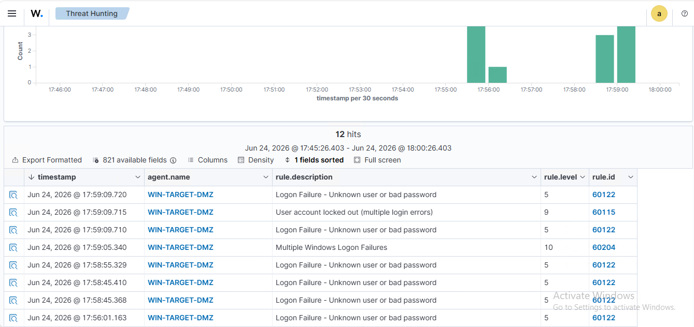

Wazuh detected multiple failed logon attempts and account lockout activity. This showed how repeated authentication failures were escalated in the SIEM.

---

### 13. Purpleadmin Account Before Removal


PowerShell verification showing the `purpleadmin` account before it was removed during the hardening phase. The account was a local administrator and was used during the attack simulation.

---

### 14. WinRM Access Denied After Hardening


After hardening, Evil-WinRM access using the previous `purpleadmin` credentials failed with an authorization error.

---

### 15. WinRM Port Filtered After Hardening


Nmap validation from Kali showing port `5985/tcp` as filtered after hardening. This confirmed that WinRM was no longer openly reachable from the ATTACK zone.

---

## Key Findings

| Finding                | Result                                                                | Significance                             |
| ---------------------- | --------------------------------------------------------------------- | ---------------------------------------- |
| Segmented network path | Kali reached the DMZ target through OPNsense routing                  | Supported realistic routed testing       |
| Exposed services       | IIS, RPC, SMB, RDP and WinRM were reachable before hardening          | Defined the attack surface               |
| WinRM access           | Evil-WinRM worked with weak credentials before hardening              | Confirmed remote access risk             |
| SMB enumeration        | Authenticated SMB enumeration exposed shares and user profile folders | Confirmed post-authentication visibility |
| Wazuh monitoring       | Successful logons, failed logons and account lockout were detected    | Confirmed SIEM visibility                |
| Hardening              | Weak account removed and WinRM access restricted                      | Reduced the attack path                  |
| Validation             | Evil-WinRM failed and port `5985/tcp` became filtered                 | Confirmed the fix                        |

---

## Key Skills Demonstrated

* Enterprise network segmentation
* OPNsense firewall and routing configuration
* DMZ network design
* Kali Linux attack preparation
* Network reconnaissance
* Port scanning
* Service and version detection
* Vulnerability scanning with Nessus
* WinRM remote access testing
* SMB enumeration
* Wazuh SIEM monitoring
* Sysmon endpoint visibility
* Authentication event analysis
* Failed logon detection
* Account lockout detection
* Security hardening
* Hardening validation
* Purple Team methodology
* SOC and Blue Team workflow

---

## Documentation

Full technical documentation is available here:

[Lab Documentation](docs/lab-documentation.md)

---

## Author

Muhammad Mehdi
IT Security Developer Student
